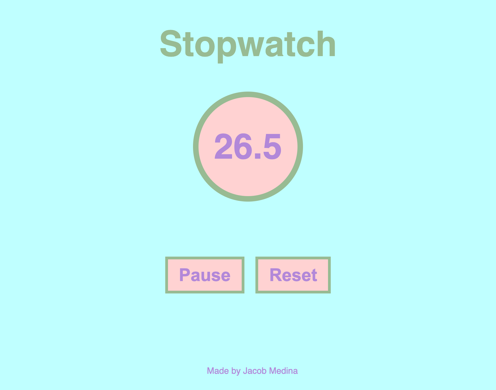

# Stopwatch

## Description

[Click here to open the live website.](https://jacob-medina.github.io/stopwatch/)

This project is an interactive stopwatch application.

The aim of this project was to develop skills with DOM event listeners and intervals. It also provides a simple tool to keep track of time to an accuracy of 1/10th of a second.

## Usage

Users may do the following:
- Resize the window to get a layout that is appropriate for the screen dimensions
- Click the **Start** button to begin the stopwatch
- Click the **Pause** button to pause the stopwatch, and the **Resume** button to resume its counting
- Click the **Reset** button to stop the stopwatch and reset its count to 0

## Licsense

This project was made under the [MIT License](./LICENSE).